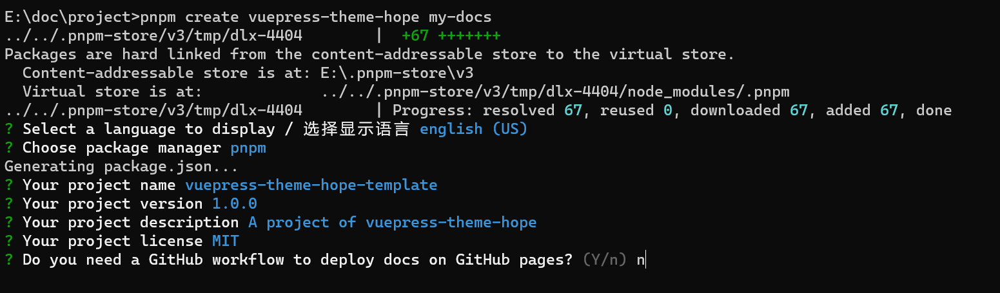

# 安装项目




## test
```java
package com.hhyy;


public class Basic01 {

    public static void main(String[] args) {
//        f1(null);

        Integer[] testArrPrint = {1,23,4,5};
        printArr(testArrPrint);
    }

    /**
     * 测试浮点类型的精度消失问题
     */
    public static void f1(String s1){
        float a = 2.0f - 1.9f;
        float b = 1.8f - 1.7f;
        System.out.println(a);
        System.out.println(b);
        System.out.println(a == b);  // false
        a = 2.0f - 1.9f;
        b = 1.9f - 1.8f;
        System.out.println(a);
        System.out.println(b);
        System.out.println(a == b); // true
    }

    public static void testStringandHashCode(){
        String s = new String("123");
        String s2 = new String("123");
        System.out.println(s.hashCode() == s2.hashCode());
        System.out.println(s.equals(s2));
        System.out.println(s == s2);
    }

    public static int f2(){
        int a = 1;
        try{
            a = 2;
            return a;
        }catch(Exception e){
            a = 3;
        }finally{
            a = 4;
            return a;
        }
    }

    /*
    静态方法由于是在类实例化之前加载， 故而其泛型类型需要在方法上指定。
    static 后面的 <E> 属于泛型的声明；
    后进的 E 属于使用该泛型
    */
    public static <E> void printArr(E[] arr){
        for (E e:arr) {
            System.out.printf("%s",e);
        }
        System.out.println();
    }
}

```