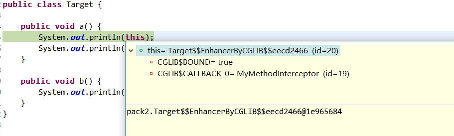
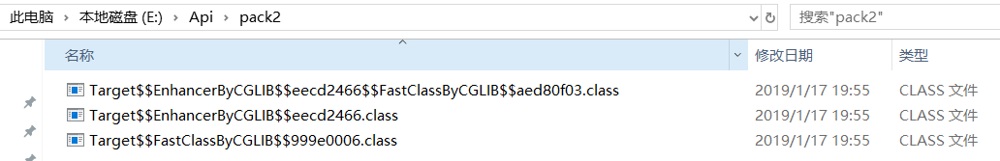

# java代理模式

## JDK自带的动态代理

就 Java 来说，动态代理的实现方式有很多种，比如 **JDK 动态代理**、**CGLIB 动态代理**等等。


**JDK 动态代理有一个最致命的问题是其只能代理实现了接口的类。**因为通过JDK Proxy 方法创建的代理对象都会继承 Proxy 类，通过继承 Proxy 类将 `InvocationHandler` 与代理对象进行绑定。之后在通过实现代理服务的接口完成对目标对象的增强。


## CGLIB 动态代理

- 代理类是被代理类的子类。
- 使用 FastClass 调用方法

## Cglib invoke以及invokeSuper的一点区别

有这样一个问题：

```java
/**
 * @param o           通过cglib动态生成的被代理对象的子类对象。也就是代理对象
 * @param method      被拦截的方法（需要增强的方法）
 * @param args        方法入参
 * @param methodProxy 用于调用原始方法
 */
@Override
public Object intercept(Object o, Method method, Object[] args, MethodProxy methodProxy) throws Throwable {
    System.out.format("方法 %s 调用前....\n",method.getName());
    Object obj = methodProxy.invokeSuper(o,args);   // flag01
    // Object obj = methodProxy.invoke(o,args);     // flag02
    System.out.format("方法 %s 调用后....\n",method.getName());
    return obj;
}
```

上述方法是 `TestMethodInterceptor`中的 `invoke` 方法。当调用 invokeSuper 时程序正常运行。但是如果执行 invoke 这会导致栈溢出。这是为什么？


简单记录下，解决的一个问题，Cglib的invoke和invokeSuper的区别：

参考：https://www.cnblogs.com/lvbinbin2yujie/p/10284316.html

简而言之，**invoke方法调用的对象没有增强过，invokeSuper方法调用的对象已经是增强了的，所以会再走一遍 MyMethodInterceptor的 interceptor方法，如果是个拦截器链条，就会重新在走一次拦截器链；**


代码准备：

```java
public class Target {
    
    public void a() {
        System.out.println(" a 方法");
    }
    
    public void b() {
        System.out.println(" b 方法");
    }
}

import java.lang.reflect.Method;
import net.sf.cglib.proxy.MethodInterceptor;
import net.sf.cglib.proxy.MethodProxy;
public class MyMethodInterceptor implements MethodInterceptor{

    @Override
    public Object intercept(Object obj, Method method, Object[] args, MethodProxy proxy) throws Throwable {
　　　　//obj是代理后的子类  ，method是调用方法 ，args是方法入参 ， proxy是MethodProxy代理对象
        System.out.println("myMethodInterceptor go ");
        Object res = proxy.invokeSuper(obj, args);
        return res;
    }
}
```


测试类：

```java
public class TestApp {

    public static void main(String[] args) {
        Enhancer e = new Enhancer();
        e.setSuperclass(Target.class);     
        e.setCallback(new MyMethodInterceptor());
        Target t=(Target) e.create();
        t.a();
    }
}
```

输出结果：

```
myMethodInterceptor go 
 a 方法
```


先解决一个疑惑，Target 这个类里面方法写 this 就是指 Cglib 生成的代理类——被代理类的子类 ，

测试在 a 方法中添加一句输出 this  ，结论：Cglib代理的时候 target 对象中的 this 就是Cglib 生成的代理类 （你可能觉得我说的是废话，子类对象在父类的this指的不是自身吗？ 你知道 Spring Aop 里 this 方法无法**增强自身调用**，这时候你就开始怀疑人生了）




既然知道了this对象就是指代的自身，那我比如 this.b() 或者 b() 应该也被回调一次了 。

```java
public class Target {
    
    public void a() {
        System.out.println(" a 方法");
        b();
    }
    
    public void b() {
        System.out.println(" b 方法");
    }
}
```

其他类不改动代码，测试结果如下： 果然 `this.b()` 方法也被增强了；

```
myMethodInterceptor go 
 a 方法
myMethodInterceptor go 
 b 方法
```

你在 b() 打个断点，下一步就跳进入 MyMethodInterceptor 的 intercept 方法里了 ；这个似乎也没有毛病，**其实原因就是 invokeSuper；invokeSuper传入的参数是Cglib代理的子类 ，就相当于 调用 Target$$EnhanceredByCGLIB 这个子类的b()方法，肯定会再次进入回调；**


如何实现像AOP一样 调用自身无法增强呢？

修改代码如下： 改动的地方做了标记 ：）

```java
public class Target {
    
    public void a() {
        System.out.println(" a 方法");
        b();
    }
    
    public void b() {
        System.out.println(" b 方法");
    }
}


public class MyMethodInterceptor implements MethodInterceptor{
    // -----------修改
    private Object target;
    
    public MyMethodInterceptor(Object target) {
        super();
        this.target = target;
    }
    // -----------修改

    @Override
    public Object intercept(Object obj, Method method, Object[] args, MethodProxy proxy) throws Throwable {
        System.out.println("myMethodInterceptor go ");
        // -----------修改
        Object res = proxy.invokeSuper(obj, args);
        //Object res = proxy.invoke(target, args);
        // -----------修改
        
        return res;
    }

}

public class TestApp {

    public static void main(String[] args) {
//        System.setProperty(DebuggingClassWriter.DEBUG_LOCATION_PROPERTY, "E:\\api");
        Target target = new Target();    // -----------修改
        Enhancer e = new Enhancer();
        e.setSuperclass(Target.class);
        e.setCallback(new MyMethodInterceptor(target));   // -----------修改
        Target t=(Target) e.create();
        t.a();
    }
}
```

测试结果如下：

```
myMethodInterceptor go 
 a 方法
 b 方法
```

这就和AOP的功能一毛一样了吧 ； **区别就在于 invoke 和 invokeSuper ： 在我理解看来，invoke方法调用的对象没有增强过，invokeSuper方法调用的对象已经是增强了的，所以会再走一遍 MyMethodInterceptor的 interceptor方法，如果是个拦截器链条，就会重新在走一次拦截器链；**


## 查看Cglib生成子类的方案思路

测试类上加上这样一句话：

```java
public class TestApp {

    public static void main(String[] args) {
        System.setProperty(DebuggingClassWriter.DEBUG_LOCATION_PROPERTY, "E:\\api");  \\ 输出代理类
        Target target = new Target();
        Enhancer e = new Enhancer();
        e.setSuperclass(Target.class);
        e.setCallback(new MyMethodInterceptor(target));
        Target t=(Target) e.create();
        t.a();
    }
}
```

可以看到确实生成了CGLIB子类class文件；

  第一个文件：**代理类**的**FastClass类**

  第二个文件：**代理类**，继承自被代理类

  第三个文件：被代理类的 **FastClass 类**




