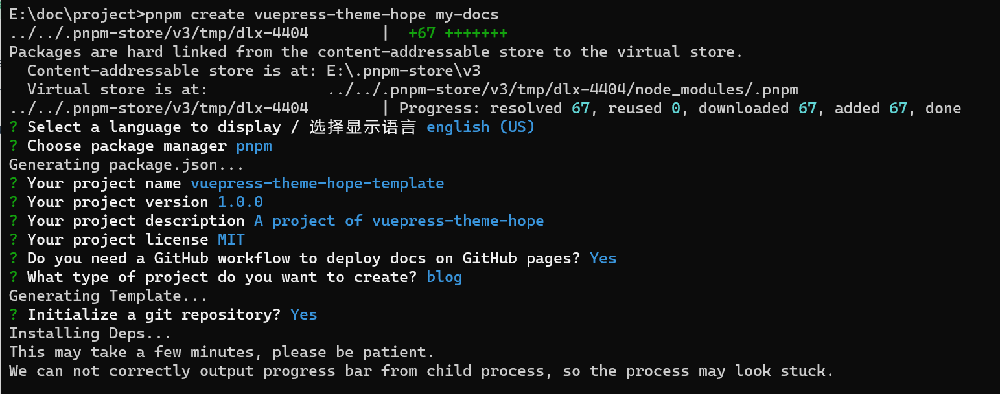
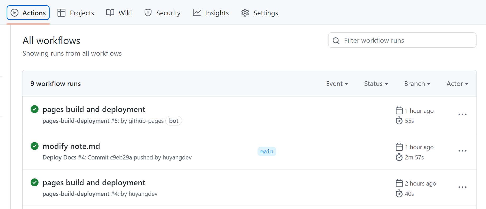
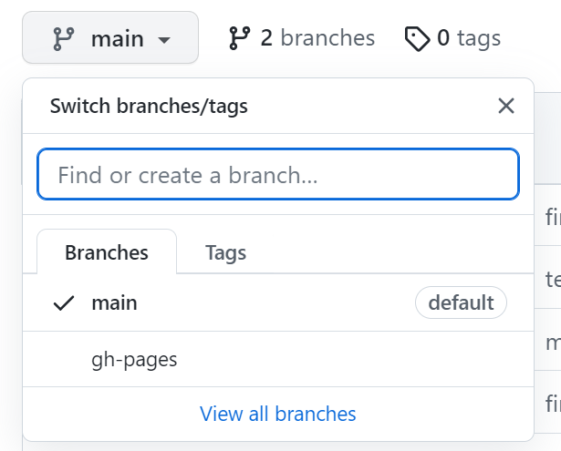

部署 `Vuepress` 项目到 `Github Page` 上，并且使用 `Vuepress-theme-hope` 主题。

<!-- more -->

# 1. vuepress-heme-hope 的使用

使用教程：[Cookbook | vuepress-theme-hope](https://vuepress-theme-hope.github.io/v2/cookbook/#tutorial)

依次安装：nodejs、pnpm

# 2. 创建项目

```sh
pnpm create vuepress-theme-hope my-docs
```



需要注意的是 `Do you need a GitHub workflow to deploy docs on GitHub pages? Yes` 这个问题要选择 `Y`，不过不选择也没事，后续手动创建 `my-docs\.github\workflows\deploy-docs.yml`即可。

deploy-docs.yml的内容如下（只需要将相关工具的版本修改为匹配自己的环境即可）：

```yaml

name: Deploy Docs

on:
  push:
    branches:
      # make sure this is the branch you are using
      - main

jobs:
  deploy-gh-pages:
    runs-on: ubuntu-latest
    steps:
      - name: Checkout
        uses: actions/checkout@v3
        with:
          fetch-depth: 0
          # if your docs needs submodules, uncomment the following line
          # submodules: true

      - name: Install pnpm
        uses: pnpm/action-setup@v2
        with:
          version: 7
          run_install: true


      - name: Setup Node.js
        uses: actions/setup-node@v3
        with:
          node-version: 18
          cache: pnpm


      - name: Build Docs
        env:
          NODE_OPTIONS: --max_old_space_size=8192
        run: |-
          pnpm run docs:build
          > src/.vuepress/dist/.nojekyll

      - name: Deploy Docs
        uses: JamesIves/github-pages-deploy-action@v4
        with:
          # This is the branch where the docs are deployed to
          branch: gh-pages
          folder: src/.vuepress/dist
```


下载完相关依赖后，会提示 `Would you like to preview template now? Yes` 这里选择 `yes` 项目就会启动了。当然，也可以使用 `pnpm run docs:dev` 进行运行。


## 2.1 设置 base

src/.vuepress/config.ts

```
将其中的 base: "/"
修改为：
base: "/my-docs/", # 这里的 my-docs 为后面创建的 Github 仓库的名称
```


# 3. Github相关配置

## 3.1 创建仓库并关联

1. 首先在 `Github` 中创建一个仓库，比如叫：`my-docs`。（这一步与上一步中的 `base` 的 `val` 需要一致）
2. 配置本地项目与 `my-docs` 的远程链接

```
1. git init 
2. git add src/ .github/ package.json .gitignore pnpm-lock.yaml .git/
3. git commit -m "first"
4. git branch -M main
5. git remote add origin git@github.com:huyangdev/111.git
6. git push -u origin main
```

推送成功之后。

## 3.2 设置 Actions 的权限

项目页面中依次选择：`Settings->Actions->General->Workflow permissions`

选择其中的 `Read and write permissions`。这一步时为工作流添加读写权限。


## 3.3  workflows

如果下图中有执行失败的 `workflow` 。只需要手动从新执行一遍。



完成之后应当会出现一个分支 `gh-pages`



# 4.设置 Github page


访问 `https://<username>.github.io/my-docs/`。若是 404 可以查看 `Actions` 中的 `workflow` 是否出错，从而排查问题。

