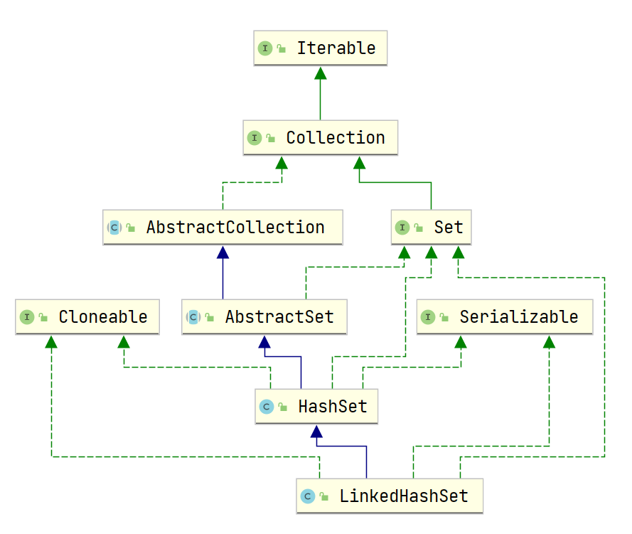
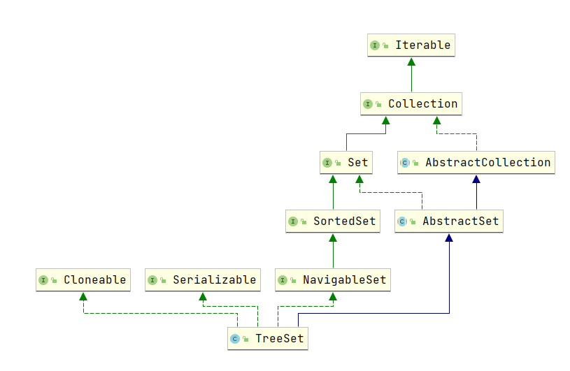

部署 `Vuepress` 项目到 `Github Page` 上，并且使用 `Vuepress-theme-hope` 主题。

对`java`的集合部分做一个面试的整理

<!-- more -->

下面是一张集合的架构图（来源菜鸟教程）。


# List


# Set

### HashSet、LinkedHashSet 和 TreeSet 三者的异同

- 相同：都是Set接口的子类，保证元素唯一。其中`HashSet`与`LinkedHashSet`都是都是通过`HashMap`来实现的。`LinkedHashSet`继承于`HashSet`最终实现是基于`LinkedHashMap`而`LinkedHashMap`还是基于`HashMap`实现。
- 不同：`HashSet`的底层数据结构是哈希表（基于 `HashMap` 实现）。`LinkedHashSet` 的底层数据结构是链表和哈希表，元素的插入和取出顺序满足 FIFO。`TreeSet` 底层数据结构是红黑树，元素是有序的，排序的方式有自然排序和定制排序。
- 底层数据结构不同又导致这三者的应用场景不同。`HashSet` 用于不需要保证元素插入和取出顺序的场景，`LinkedHashSet` 用于保证元素的插入和取出顺序满足 FIFO 的场景，`TreeSet` 用于支持对元素自定义排序规则的场景。




# Collection 子类 Queue

## Queue 与 Deque 的区别

Queue是单端队列，Deque是双端队列。


## ArrayDeque 与 LinkedList 的区别

`ArrayDeque` 和 `LinkedList` 都实现了 `Deque` 接口，两者都具有队列的功能，但两者有什么区别呢？

- `ArrayDeque` 是**基于可变长的数组**和**双指针**来实现，而 `LinkedList` 则通过**链表**来实现。
- `ArrayDeque` **不支持**存储 `NULL` 数据，但 `LinkedList` 支持。
- `ArrayDeque` 是在 **JDK1.6** 才被引入的，而`LinkedList` 早在 JDK1.2 时就已经存在。
- `ArrayDeque` 插入时可能存在扩容过程, 不过均摊后的插入操作依然为 O(1)。虽然 `LinkedList` 不需要扩容，但是每次插入数据时均需要申请新的堆空间，均摊性能相比更慢。

## PriorityQueue

`PriorityQueue` 是在 **JDK1.5** 中被引入的, 其与 `Queue` 的区别在于元素**出队顺序是与优先级相关**的，即总是优先级最高的元素先出队。

这里列举其相关的一些要点：

- `PriorityQueue` 利用了**二叉堆**的数据结构来实现的，底层使用**可变长的数组**来存储数据
- `PriorityQueue` 通过**堆元素的上浮和下沉**，实现了在 **O(logn)** 的时间复杂度内插入元素和删除堆顶元素。
- `PriorityQueue` 是**非线程安全**的，且不支持存储 `NULL` 和 `non-comparable` 的对象。
- `PriorityQueue` 默认是**小顶堆**，但可以接收一个 `Comparator` 作为构造参数，从而来自定义元素优先级的先后。


# Map

## HashMap 与 HashTable

- 线程安全

`HashMap` 是线程不安全的。`HashTable`（基本淘汰） 是线程安全的。如果需要使用线程安全的 `HashMap` 可以直接使用 `ConcurrentHashMap`。

- 效率

由于线程安全方面的因素，`HashMap` 要比 `HashTable` 快 

- 对 Null key 与 Null value 的支持

`HashMap` 可以存储 Null 的 Key 与 value，但 null 作为键只能有一个，null 作为值可以有多。

`HashTable` 不支持Null

- 初始容量与扩容机制

1. 创建时如果不指定容量初始值，`Hashtable` 默认的初始大小为 **11**，之后每次扩充，容量变为原来的 **2n+1**。`HashMap` 默认的初始化大小为 **16**。之后每次扩充，容量变为原来的 **2 倍**。
2. 创建时如果给定了容量初始值，那么 `Hashtable` 会直接使用你给定的大小，而 `HashMap` 会将其**扩充为 2 的幂次方大小**（`HashMap` 中的`tableSizeFor()`方法保证，下面给出了源代码）。也就是说 `HashMap` 总是使用 **2 的幂**作为哈希表的大小，后面会介绍到为什么是 2 的幂次方。

- 底层数据结构

**JDK1.8** 以后的 `HashMap` 在解决哈希冲突时有了较大的变化，当链表长度大于阈值（默认为 8）时，将链表转化为**红黑树**（将链表转换成红黑树前会判断，如果当前数组的**长度小于 64**，那么会选择先进行数组扩容，而不是转换为红黑树），以减少搜索时间（后文中我会结合源码对这一过程进行分析）。`Hashtable` 没有这样的机制。


## HashMap 和 HashSet 区别

| **HashMap**                          | HashSet                                                      |
| ------------------------------------ | ------------------------------------------------------------ |
| 实现了Map接口                        | 实现了Set接口                                                |
| 存储键值对                           | 仅存储键对象，通过键的hash值判别唯一                         |
| 调用put（）添加元素                  | 调用add添加元素                                              |
| HashMap` 使用键（Key）计算 `hashcode | `HashSet` 使用成员对象来计算 `hashcode` 值，对于两个对象来说 `hashcode` 可能相同，所以`equals()`方法用来判断对象的相等性 |

## HashMap 和 TreeMap 区别

但凡是 `TreeXXX` 基本都是继承于 `NavigableXXX`。而`NavigableXXX`基本继承 `SortedXXX`。

比如 `TreeSet`：



`TreeMap`与之类似，实现了`NavigableMap`与`SrotedMap`。实现 `NavigableMap` 接口让 `TreeMap` 有了对集合内元素的搜索的能力。实现`SortedMap`接口让 `TreeMap` 有了对集合中的元素根据键排序的能力。默认是按 key 的升序排序，不过我们也可以指定排序的比较器。示例代码如下：

```java
/**
 * @author shuang.kou
 * @createTime 2020年06月15日 17:02:00
 */
public class Person {
    private Integer age;

    public Person(Integer age) {
        this.age = age;
    }

    public Integer getAge() {
        return age;
    }


    public static void main(String[] args) {
        TreeMap<Person, String> treeMap = new TreeMap<>(new Comparator<Person>() {
            @Override
            public int compare(Person person1, Person person2) {
                int num = person1.getAge() - person2.getAge();
                return Integer.compare(num, 0);
            }
        });
        treeMap.put(new Person(3), "person1");
        treeMap.put(new Person(18), "person2");
        treeMap.put(new Person(35), "person3");
        treeMap.put(new Person(16), "person4");
        treeMap.entrySet().stream().forEach(personStringEntry -> {
            System.out.println(personStringEntry.getValue());
        });
    }
}
```

Output：

```
person1
person4
person2
person3
```


## HashMap 的长度为什么是 2 的幂次方

为了能让 HashMap 存取高效，尽量较少碰撞，也就是要尽量把数据分配均匀。我们上面也讲到了过了，Hash 值的范围值-2147483648 到 2147483647，前后加起来大概 40 亿的映射空间，只要哈希函数映射得比较均匀松散，一般应用是很难出现碰撞的。但问题是一个 40 亿长度的数组，内存是放不下的。所以这个散列值是不能直接拿来用的。用之前还要先做对数组的长度取模运算，得到的余数才能用来要存放的位置也就是对应的数组下标。这个数组下标的计算方法是“ `(n - 1) & hash`”。（n 代表数组长度）。这也就解释了 HashMap 的长度为什么是 2 的幂次方。

